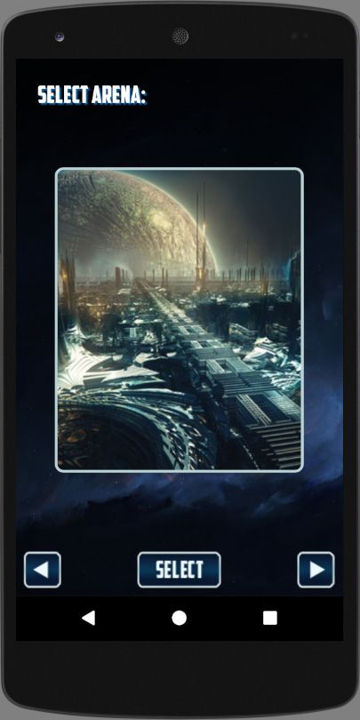
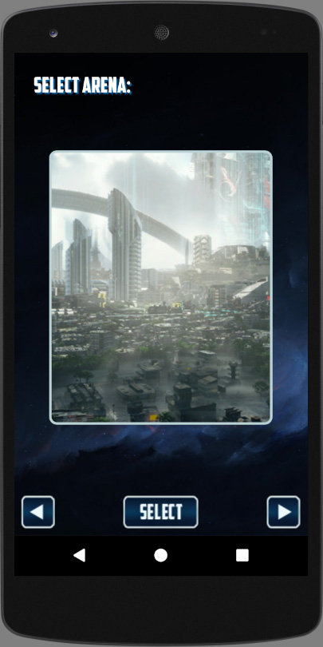
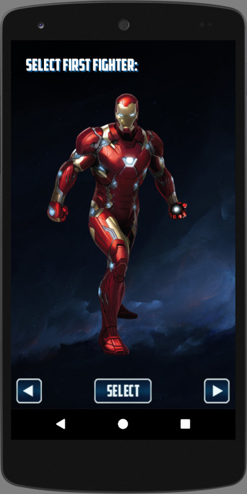
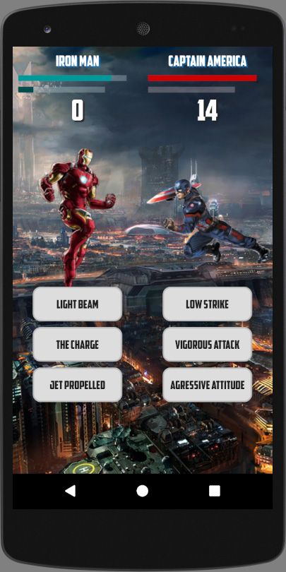
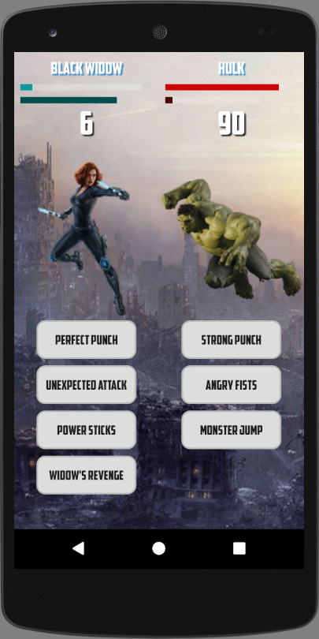
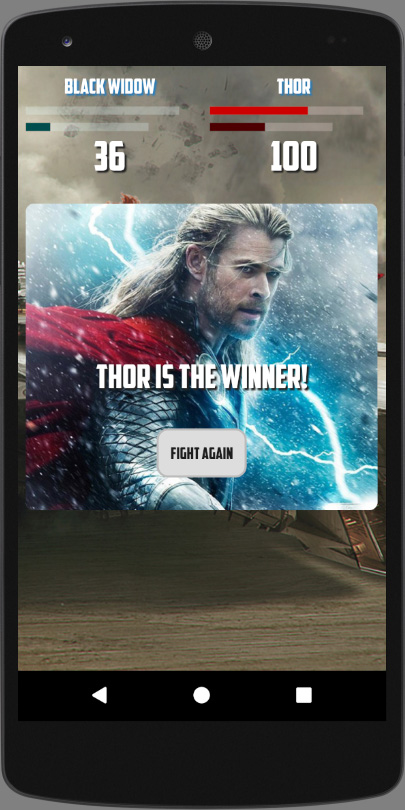

# Score Keeper

Project #2 for Google Developer Challenge Scholarship: Android Basics / Android Basics by Google Nanodegree Program

<h3>Layout</h3>
<table>
  <tr>
    <th>Criteria</th>
    <th>Meets Specifications</th>
  </tr>
  <tbody>
    <tr>
      <td>
        
Game Chosen

      </td>
      <td>
        
The chosen game has either multiple amounts of points that can be scored, as in american football, or multiple important metrics to track, such as fouls, outs, and innings in baseball.

      </td>
    </tr>
    <tr>
      <td>
        
Overall layout

      </td>
      <td>
        
App is divided into two columns, one for each team.

      </td>
    </tr>
    <tr>
      <td>
        
Column contents

      </td>
      <td>
        
Each column contains a large TextView to keep track of the current score for that team.

        
Optionally, a second TextView to track another important metric such as fouls can be added.

      </td>
    </tr>
    <tr>
      <td>
        
Score buttons

      </td>
      <td>
        
Each column contains multiple buttons. The buttons must track either:

        
Each track a different kind of scoring

        
Or

        
Each track a different metric (one score, the other fouls, for instance).

      </td>
    </tr>
    <tr>
      <td>
        
Reset button

      </td>
      <td>
        
The layout contains a ‘reset’ button.

      </td>
    </tr>
    <tr>
      <td>
        
Best practices

      </td>
      <td>
        
"The code adheres to all of the following best practices:

        <ul>
          <li>Text sizes are defined in sp</li>
          <li>Lengths are defined in dp</li>
          <li>Padding and margin is used appropriately, such that the views are not crammed up against each other."</li>
        </ul>
      </td>
    </tr>
  </tbody>
</table>

<h3>Functionality</h3>
<table>
  <tr>
    <th>Criteria</th>
    <th>Meets Specifications</th>
  </tr>
  <tbody>
    <tr>
      <td>
        
Errors

      </td>
      <td>
        
The code runs without errors.

      </td>
    </tr>
    <tr>
      <td>
        
Score Button Function

      </td>
      <td>
        
Each score button updates the score TextView in its column by adding the correct number of points.

      </td>
    </tr>
    <tr>
      <td>
        
Reset Button Function

      </td>
      <td>
        
The reset button resets the scores on both of the score TextViews.

      </td>
    </tr>
  </tbody>
</table>

<h3>Code Readability</h3>
<table>
  <tr>
    <th>Criteria</th>
    <th>Meets Specifications</th>
  </tr>
  <tbody>
    <tr>
      <td>
        
Naming conventions

      </td>
      <td>
        
"Any classes are named after the object they represent.All variables are named by their intended contents.

        
All methods are named by their intended effect or in the style required by a callback interface."

      </td>
    </tr>
    <tr>
      <td>
        
Code style

      </td>
      <td>
        
"There are no unnecessary blank lines.One variable is declared per declaration line.

        
The code within a method is indented with respect to the method declaration line."

      </td>
    </tr>
  </tbody>
</table>

<em>Requirements copied from: <a href="http://udacity.com">udacity.com</a>.</em>

 

 
  
  

 
  
  

 
  
  

 
  

